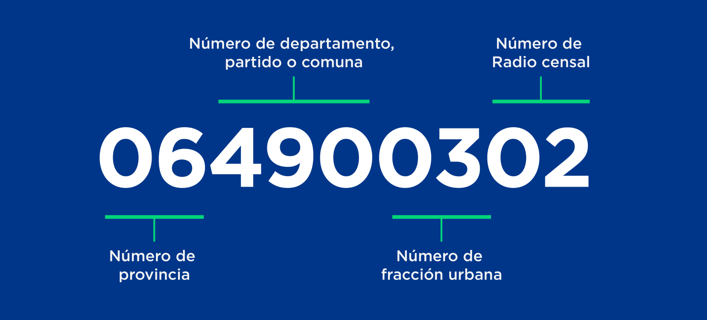

```{r setup, include=FALSE}
knitr::opts_chunk$set(echo = TRUE, message = FALSE, warning = FALSE)
knitr::opts_chunk$set(fig.pos = 'H')
```

_Este articulo fue originalmente publicado en el [siguiente link](https://medium.com/datos-argentina/qu%C3%A9-son-los-radios-censales-y-para-qu%C3%A9-sirven-7c6099735d82)_

### ¿Cómo podemos conocer por adelantado qué hay en el territorio?

Cuando nos enfrentamos a diferentes problemas de política pública, **es importante entender y tener en cuenta el territorio** donde se van a implementar. Un plan de acción diseñado para la Ciudad de Buenos Aires difícilmente sea replicable en una ciudad del interior debido a diferencias intrínsecas al territorio y la población de uno y otro lugar.

Para analizar estas diferencias y estimar el impacto se pueden utilizar las **unidades geoestadísticas**: unidades geográficas censales compuestas de divisiones territoriales y administrativas, producidas por el [Instituto Nacional de Estadística y Censos de la República Argentina](https://www.indec.gov.ar/codgeo.asp) (INDEC). Una de esas unidades geoestadísticas son los radios censales.

### ¿Qué es un Radio Censal y cómo se construye?

**Es una unidad geográfica que agrupa, en promedio 300 viviendas en las ciudades**. Si los radios son rurales o rurales mixtos, la cantidad promedio es menor.

Actualmente Argentina se compone de un total de **51.408 radios censales**, diseñados y mantenidos por el [INDEC](https://geoservicios.indec.gov.ar/codgeo/index.php?pagina=definiciones).

El identificador de un radio censal es un código numérico único de 9 cifras. Este código **relaciona a diferentes unidades censales que pueden ordenarse jerárquicamente** de modo tal que unas contienen a las otras, aunque no en todos los casos. Si querés profundizar un poco en esta temática, te invitamos a leer nuestra [guía para la identificación y uso de entidades interoperables](https://datosgobar.github.io/paquete-apertura-datos/guia-interoperables/#guia-para-la-identificacion-y-uso-de-entidades-interoperables).

<!--  -->

El código del radio censal es el resultado de una concatenación de códigos. Tomemos como ejemplo el radio censal **064900302** del Partido de Lomas de Zamora:

* Los primeros dos dígitos (06) pertenecen a las **“Jurisdicciones de primer orden”** o División Político-Territorial: las 23 provincias y la Ciudad Autónoma de Buenos Aires. En nuestro ejemplo, se refiere a la Provincia de Buenos Aires.
* Los tres dígitos siguientes (490) son las **“Jurisdicciones de segundo orden”** o “Divisiones Político-Administrativas” y son los partidos de la Provincia de Buenos Aires, las comunas de la Ciudad Autónoma de Buenos Aires y los departamentos de las demás provincias. En nuestro ejemplo, corresponde al Partido de Lomas de Zamora.
* Los próximos 2 dígitos (03) corresponden a las **fracciones urbanas**. Es una medida geográfica que agrupa, en promedio, 5000 viviendas.
Los últimos dos dígitos (02) corresponden, finalmente, al **radio censal**.


### ¿Qué información se tiene para los radios censales?

En la Argentina hay mucha información publicada por distintos organismos públicos que se encuentran agregados a nivel de radios censales. Por ejemplo, junto a los archivos geográficos de cada provincia, INDEC publica cinco variables básicas de las tres unidades de relevamiento del censo (población, hogares y viviendas) proveniente del último censo (2010): **población total por sexo, total de hogares, total de viviendas particulares y total de viviendas particulares habitadas**. A su vez, el INDEC también publica la base de datos del Censo Nacional de Población, Hogares y Viviendas 2010 en [REDATAM](https://redatam.indec.gob.ar/argbin/RpWebEngine.exe/PortalAction?BASE=CPV2010B).


### Visualizando mapas con R

Lo primero que vamos a tener que hacer es descargar el archivo [_“shapefile”_](https://es.wikipedia.org/wiki/Shapefile) del territorio con el que vamos a trabajar. La fuente oficial en la Argentina es el Instituto Nacional de Estadística y Censos de la República Argentina (INDEC) y podemos acceder a ellos a través de la siguiente [página](https://www.indec.gov.ar/codgeo.asp). Para este tutorial vamos a trabajar con datos de la Provincia de Córdoba, por lo tanto vamos a descargar el siguiente archivo:

https://www.indec.gov.ar/ftp/cuadros/territorio/codgeo/Codgeo_Cordoba_con_datos.zip

Una vez que lo hemos descargado, vamos a abrir el archivo utilizando el paquete `sf`^[Aquí un [manual](https://cran.r-project.org/web/packages/sf/sf.pdf) y un [tutorial](https://cran.r-project.org/web/packages/sf/vignettes/sf1.html), ambos en inglés]. 

```{r, warning=FALSE, message=FALSE}
# Instalamos los paquetes si no están instalados en nuestras computadoras
# install.packages("tidyverse")
# install.packages("sf")

# Carga de los paquetes a utilizar
library(tidyverse)
library(sf)

# Abriendo el shp
radios.cordoba <- st_read("/Users/lauticantar/Google Drive/Github/Documentos_blog/Codgeo_Cordoba_con_datos/", layer = "Cordoba_con_datos") 
```

Cuando cargamos el archivo geográfico, vemos el siguiente mensaje en la consola. ¿Qué significan cada una de las lineas?:

* `Simple feature collection with 4752 features and 8 fields`: estamos abriendo un dataset que contiene `r nrow(radios.cordoba)` filas y `r ncol(radios.cordoba)-1` columnas.
* `geometry type: MULTIPOLYGON`: los archivos con información geográfica contienen colecciones de puntos, de líneas, o de polígonos y sus respectivas versiones "múltiples": múltiples puntos, líneas o polígonos Los Radios Censales son múltiples polígonos.
* `dimension: XY`: es la cantidad de dimensiones con las que se está trabajando, en este caso, dos. Si hubiese tres dimensiones, sería _XYZ_.
* `bbox: xmin: 3521762 ymin: 6124005 xmax: 3898182 ymax: 6736174`: _bbox_ es la simplificación para _"bounding box"_, una caja delimitadora. Estos valores son la latitud mínima, la longitud mínima, la latitud máxima y la longitud máxima del conjunto de datos
* `epsg (SRID): NA` y `proj4string: +proj=tmerc +lat_0=-90 +lon_0=-66 +k=1 +x_0=3500000 +y_0=0 +ellps=WGS84 +units=m +no_defs`: nos brindan información referida al sistema de coordenadas de referencia (_Coordinate Reference System (CRS)_). 

Como vemos en el punto anterior, `epsg (SRID):` es `NA`. Por lo tanto, lo que se debe hacer es transformarlo al mismo _CRS_ que vamos a utilizar a lo largo del trabajo *EPSG: 4326* y para ello vamos a utilizar la función `st_transform()`.

```{r}
radios.cordoba <- st_transform(radios.cordoba, crs = 4326)
```

La primer aproximación a este dataset debería ser ver que datos tiene:

```{r}
# Exploración inicial de datos
summary(radios.cordoba)
```

Aquí vemos que el archivo `radios.cordoba` tiene las siguientes variables:

* `toponimo_i`: Identificación única propia del archivo
* `link`: ID del Radio Censal 
* `varon`: cantidad de varones en dicho radio censal
* `mujer`: cantidad de mujeres en dicho radio censal
* `totalpobl`: población total 
* `hogares`: cantidad total de hogares
* `viviendasp`: total de viviendas particulares
* `viv_part_h`:  total de viviendas particulares habitadas
* `geometry`: información geográfica que utiliza R para hacer la visualización del mapa.

El siguiente paso será visualizar los radios censales de la Provincia de Córdoba. Para dicha tarea hay una gran variedad de paquetes en R que responden a distintas necesidades. Nosotros vamos a utilizar el paquete `ggplot2` para las visualizaciones estáticas (preferible, por ejemplo, para la elaboración de informes impresos) y el paquete `leaflet` para las visualizaciones dinámicas (preferible para la exploración interactiva). 

Vayamos primero con `ggplot2`:

```{r, warning=FALSE, message=FALSE}
# Instalamos los paquetes si no están instalados en nuestras computadoras
# install.packages("ggplot2")

# Carga de los paquetes a utilizar
library(ggplot2)

ggplot() + geom_sf(data = radios.cordoba) +
  labs(title = "Radios Censales de la Provincia de Córdoba",
         subtitle = "Fuente: INDEC")
```

Lo primero que se puede ver a simple vista es el contorno de la Provincia de Córdoba. Lo segundo que se puede apreciar es el tamaño dispar de muchos de los radios censales, concentrándose los más pequeños alrededor de las ciudades y los más extensos en el medio del campo. La desventaja es que si como analistas queremos explorar un área con mayor detenimiento, deberíamos usar algún paquete interactivo, como `leaflet`.

```{r, warning=FALSE, message=FALSE}
# Instalamos los paquetes si no están instalados en nuestras computadoras
# install.packages("leaflet")

# Carga de los paquetes a utilizar
library(leaflet)

leaflet() %>%
     addTiles() %>%
     addProviderTiles("CartoDB.Positron") %>%
     # Mapeando los poligonos de Cordoba
     addPolygons(data = radios.cordoba,
                 color = "grey", weight = 1, smoothFactor = 0.5,
                 opacity = 1.0)
```

De esta manera tenemos el mismo mapa que antes, pero ahora podemos explorar el mapa interactivamente, hacer zoom en alguna ciudad o movernos por la provincia.

### ¿Qué información se puede construir para los radios censales?

Utilizando Sistemas de Información Geográfica (SIG o GIS en inglés) y distintas fuentes de datos, **se pueden construir una amplia variedad de capas de información**, por ejemplo: cantidad de escuelas por radio censal, porcentaje de personas con necesidades básicas insatisfechas, porcentaje del radio censal ocupado por un barrio popular, etc.
